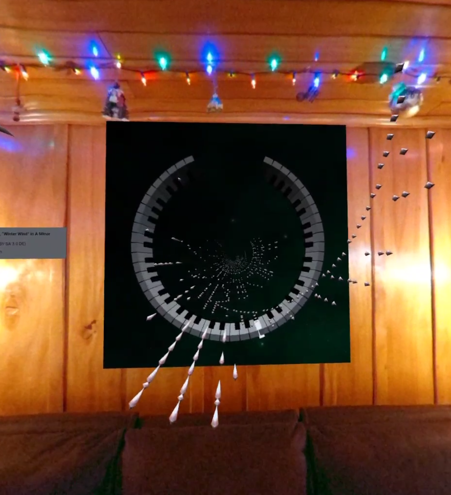

# Babylon.js "magic" piano portal

An augmented-reality WebXR animation of Chopin's "Winter Wind" Étude to hang on your wall! Works on flat-screen, too.

See it live at https://demos.babylonjs.com/piano-portal/.

For the WebXR version, use a Meta Quest 2 or Quest Pro with passthrough turned on and setup your room's walls with the Room Setup configuration tool found in the experimental settings.

[](https://www.babylonjs.com/)




## Build instructions

Install Node.js and NPM then run the following commands:
```
npm install
npm build
```

To run the Webpack dev server locally, run:
```
npm start
```
...and go to https://localhost:8080 in your browser. You'll get a warning about it being unsecure, but the browser should give the option to click through to the website anwyay.


## Notes

The "magic" portal uses a stencil buffer and a clip plane. A minimal example can be found at https://playground.babylonjs.com/#A1Z15H#7.

The keyboard model is a modified version from the [Babylon.js Piano tutorial](https://learn.microsoft.com/en-us/windows/mixed-reality/develop/javascript/tutorials/babylonjs-webxr-piano/keyboard-interaction-03). A minimal example  can be found at https://playground.babylonjs.com/#Z02BBJ#6.

The MIDI file used in this project was created by Bernd Krueger. It can be found at http://www.piano-midi.de/chopin.htm.
<br>
[](https://creativecommons.org/licenses/by-sa/3.0/de/deed.en)
